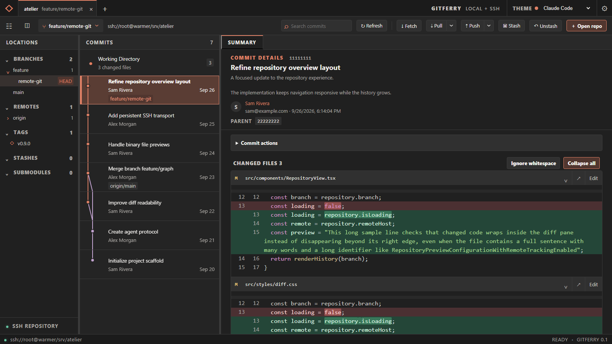

# GitFerry

GitFerry is a desktop Git client for local working trees and Git repositories on SSH hosts. It uses Tauri 2, SolidJS, and a small Rust agent that runs Git beside the repository.



*GitFerry with a demo repository, shown in the Claude Code theme.*

## Run locally

Requirements: Rust, Node.js, pnpm, Git, and the [Tauri 2 platform prerequisites](https://v2.tauri.app/start/prerequisites/).

```powershell
cd app
pnpm install
pnpm tauri dev
```

Open a local folder, or enter an SSH host and absolute repository path in the Open dialog. SSH connections use the system OpenSSH client and your existing SSH configuration. The remote host must be Linux x64 or arm64 and provide `sh`, `head`, and Git. The appropriate static agent is uploaded to `~/.cache/gitferry` when its content hash is not present.

## Available now

- Repository tabs with overflow scrolling and an open-tab list, recent repositories, branch and remote folders, tags/stashes/submodules sidebar, paged commit history and graph, commit details, working-tree status, and diffs.
- Summary shows every changed file's diff in one scrollable view, expanded by default with per-file, per-group, and global expand/collapse controls. File tabs give diffs the full details pane, with syntax colors, changed-word highlights, and wrapped long lines.
- File, hunk, and line staging/unstaging; commit/amend; fetch, pull with fast-forward/merge/rebase, push with automatic upstream setup, branch switching/creation/safe deletion, and stash.
- Branch merge and rebase, interactive rebase planning for linear history (reorder, pick, reword, edit, squash, fixup, drop), conflict selection (ours/theirs or manual edit), continue/abort, and commit cherry-pick, revert, reset, detached checkout, and tag creation/deletion.
- Rename and force-delete local branches; push or delete remote branches and tags. Browse tracked files, file history, and line blame from the details pane.
- Ignore-whitespace diff view. Line and hunk actions are disabled while this filter is active so they always use the exact patch shown.
- Open changed files in an external editor at the first changed line from Summary or a file tab. Choose Antigravity, VS Code, or Sublime Text in Settings and optionally set its CLI path. SSH files use the editor's Remote SSH mode (Antigravity or VS Code).
- Commit search by message; prefix with `author:` or `path:` to search those fields.
- Resizable panes with side or bottom details layout, draggable repository tabs, folder drop, and a command palette with Ctrl+P.
- Keyboard navigation: Up/Down or j/k moves through commits or files in the focused pane, Right/Left switches panes, Enter expands or collapses a selected file, and Ctrl+Enter (Cmd+Enter on macOS) commits staged changes.
- Larger repository labels and a saved theme picker in the top bar: Antigravity Dark, VS Code Dark, Sublime Merge, and Claude Code.
- Filesystem change watching with a slower polling fallback where watching is unavailable; full refresh on focus or Ctrl+R. Ctrl+O opens a repository.
- Live fetch/pull/push progress and cancellation. SSH tabs use separate read, action, watch, and cancel sessions.

## Build and test

```powershell
cargo test -p gitferry-agent
cd app
pnpm exec tsc --noEmit
pnpm test:ui
pnpm tauri build
```

`pnpm test:ui` uses headless Chrome and disposable Git repositories. It clicks through staging, commits, fetch/pull/push, branches, merge/rebase conflicts, tags, stash, diffs, themes, and layouts without opening a desktop window. Set `CHROME_PATH` if Chrome is installed elsewhere. Optionally set `GITFERRY_REAL_REPO` to inspect a large local repository in read-only mode.

On a machine with limited free space on the system drive, set `CARGO_TARGET_DIR` to a roomy drive before building. This workspace's Windows release build was verified with `CARGO_TARGET_DIR=D:\GitFerry-build`.
The Windows installer can be built with `pnpm tauri build --bundles nsis --ci`.

The Linux agent binaries are bundled in `app/src-tauri/resources/`. Pushes and pull requests run frontend checks and agent tests on Linux. Run the Build GitFerry workflow manually for the full Windows, macOS, and Linux desktop matrix, or select its `agents_only` input to rebuild only the SSH agents; version tags build the release installers. See [PLAN.md](PLAN.md) for the full roadmap.
An arm64 macOS desktop build and all seven agent repository tests passed on a test Mac. The `.app` launched successfully; its temporary build, app bundle, and caches were removed afterward.
The SSH smoke test against the isolated `warmer` repository covered snapshot, diff, stage, commit, search, and push; the pushed bare remote ref was verified against the working repository's HEAD.

## GitHub releases

Pushing a `vX.Y.Z` tag matching the versions in `app/package.json` and `app/src-tauri/tauri.conf.json` runs `.github/workflows/release.yml`. It builds Windows x64 (NSIS), macOS Apple Silicon and Intel (DMG), and Linux x64 (Debian package and AppImage). The release starts as a draft and is published only after all builds succeed.

The macOS bundles use ad-hoc signing and are not notarized; Windows installers are not certificate signed. Operating systems may show an approval warning when installing downloaded builds.

Known gaps against [PLAN.md](PLAN.md): a visual conflict editor, agent forwarding, and a light theme are still pending. Syntax colors currently cover common source and configuration formats. Interactive rebase planning supports linear history only. A filesystem watcher that cannot be established falls back to an 8-second status check while the window is focused.
