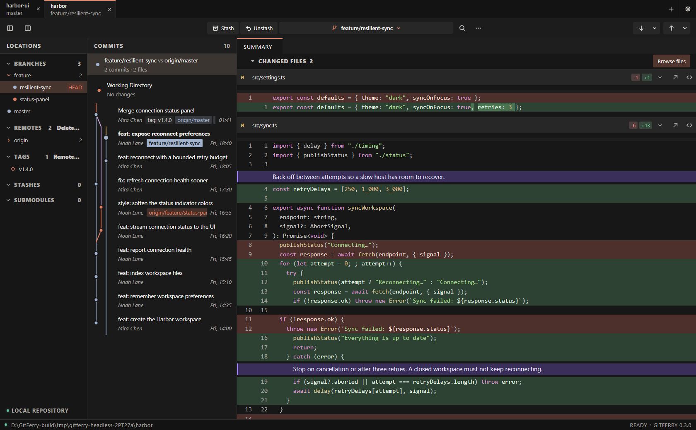
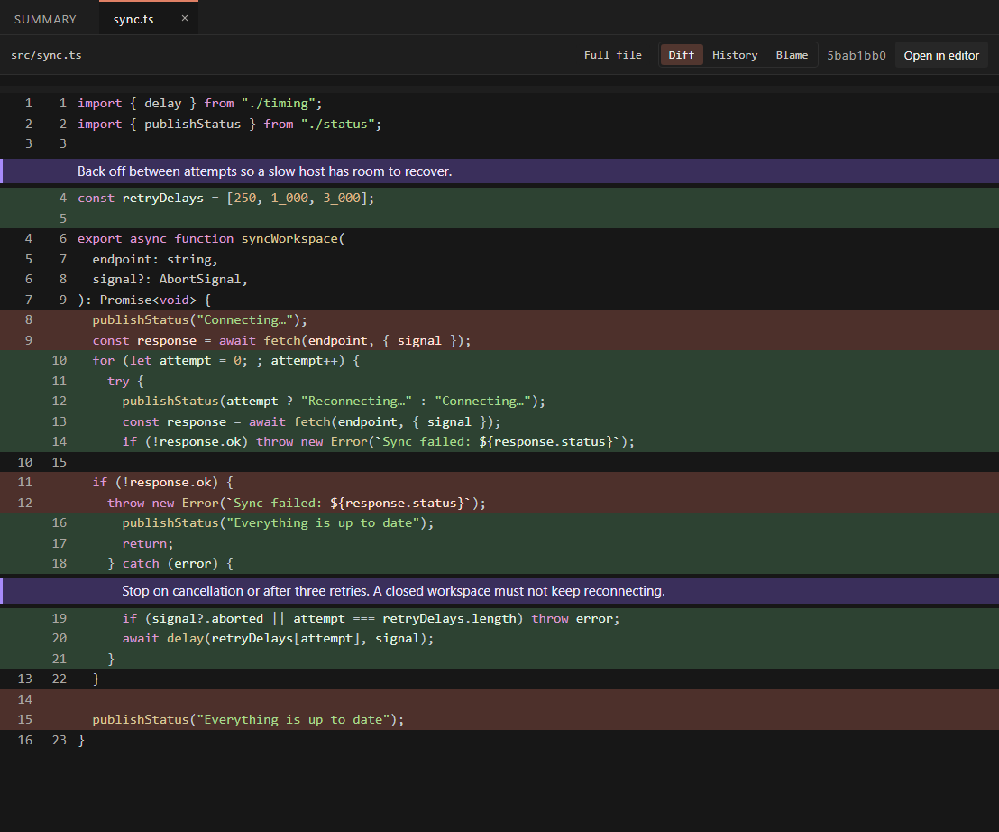
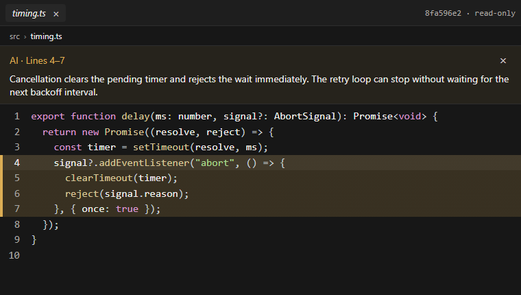
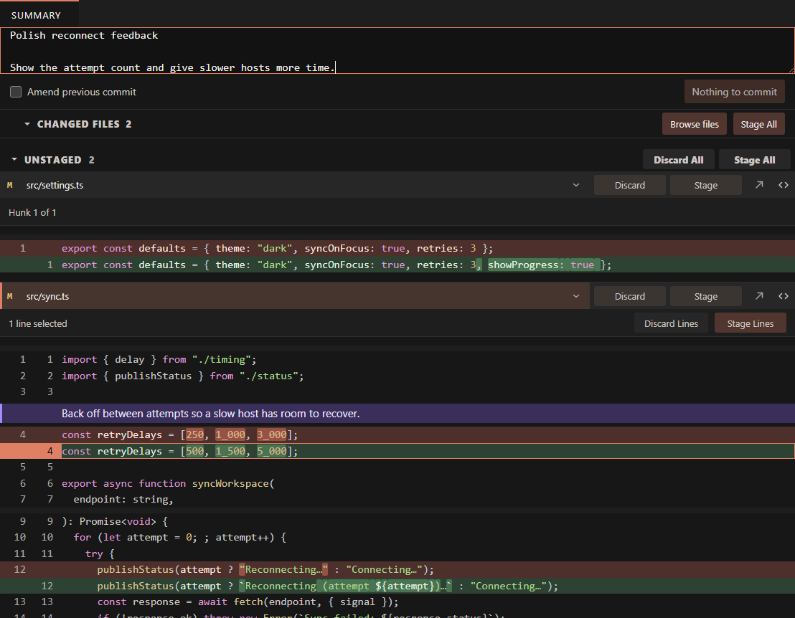

<div align="center">
  
  <h1>GitFerry</h1>
  <p><strong>A little less Git friction.</strong></p>
  <p>Your branches, your changes, and the reason behind the code — together.</p>
  <p>
    <a href="https://github.com/TheGP/GitFerry/releases/latest"><strong>Download</strong></a> ·
    <a href="#a-clear-view-of-your-branch">Take a look</a> ·
    <a href="docs/ai-navigation.md">AI &amp; MCP</a> ·
    <a href="docs/development.md">Build from source</a>
  </p>
</div>

GitFerry is a desktop Git client inspired by Sublime Merge, built for local repositories and repositories over SSH. Review a whole branch, stage just the lines you want, and let your AI assistant point to the code it is explaining.



*Every screenshot uses fictional Harbor repositories created for the demo. Screenshots show current source; some features may be newer than the latest release.*

## A clear view of your branch

A feature branch gets an automatic comparison with `master` or `main`, pinned above the commit history. One click shows its commits and combined changes since the common ancestor. When available, the automatic comparison prefers `origin/master` or `origin/main` over the local branch.

The comparison follows both branches as they move. You can also **pull master/main from its context menu without leaving your current branch**; it fast-forwards from the configured upstream.

## The explanation belongs beside the code

AI change notes sit directly above the lines they describe. Review the implementation and the reason for it in the same place, without searching through a chat.



The format is a small JSON Lines file at `.gitferry/notes.jsonl`:

```json
{"id":"cancel-sync","file":"src/sync.ts","quote":"if (signal?.aborted || attempt === retryDelays.length) throw error;","note":"Stop on cancellation or after three retries. A closed workspace must not keep reconnecting."}
```

The quote anchors the note to the code, so it follows line shifts. Notes work in working-tree, staged, and branch-comparison diffs. Keep the notes file out of commits. [Format and agent setup →](docs/ai-navigation.md#ai-change-notes)

## “Show me the lines”

Connect an AI assistant through MCP and ask it to show its evidence in GitFerry. It can find commits, inspect history and blame, highlight a changed hunk, or open **unchanged code on a specific branch** with an explanation.



`reveal_file` opens the requested file version in the side editor, highlights the exact lines, and displays an optional explanation. Browsing a different branch does not check it out. These annotations are temporary; they do not edit repository files.

Enable **MCP for AI navigation** in Settings and copy the configuration into your AI client. [Setup, tools, and examples →](docs/ai-navigation.md#mcp-ai-navigation)

## Make the next commit yours

All changed files open in one scrollable Summary. Click line numbers to toggle a selection, then stage or unstage that selection, a hunk, or the whole file.



Syntax colors, changed-word highlights, adjustable code fonts, and wrapped long lines keep diffs readable. Double-click code to open its full file in the side editor while preserving the text selection.

Edit working files and save with **Ctrl+S**. Saving a staged file also stages the edited contents; historical file versions remain read-only. Prefer your own editor? Configure Antigravity, VS Code, or Sublime Text in Settings and jump to the changed line.

## The rest of your Git day

| | What you can do |
| --- | --- |
| **Repositories** | Restore your tabs on startup, scroll overflowing tabs, group branches by folder, and work locally or over SSH. |
| **History** | Browse the commit graph, search messages/authors/paths, inspect file history and blame, and browse tracked files. |
| **Branches** | Filter local and remote branches, create tracking branches, rename or delete branches, and manage remote branches and tags. |
| **Sync** | Fetch, pull, push, or force-push with lease. New branches get upstream setup; long operations show progress and can be cancelled. |
| **Changes** | Stage lines or hunks, commit or amend, stash and unstash, and ignore whitespace while reviewing. |
| **Integration** | Merge, rebase, cherry-pick, revert, reset, and resolve conflicts with current/incoming/both or manual edits. Continue or abort an operation. |
| **Rebase** | Reorder linear history with pick, reword, edit, squash, fixup, and drop. |
| **Your workspace** | Resize panes, place details beside or below history, choose among four themes, and configure fonts in Settings. |

### A few useful keys

| Shortcut | Action |
| --- | --- |
| **↑ / ↓** or **j / k** | Move through commits or files in the focused pane |
| **Enter** | Expand or collapse the selected file |
| **Ctrl+Enter** | Commit staged changes |
| **Ctrl+S** | Save an edited file |
| **Ctrl+P** | Open the command palette |
| **Ctrl+O** | Open a repository |

*Use Cmd for commit, save, palette, and open shortcuts on macOS.*

## Get GitFerry

[Download the latest release](https://github.com/TheGP/GitFerry/releases/latest) for **Windows x64**, **macOS Apple Silicon / Intel**, or **Linux x64**.

Windows uses an NSIS installer, macOS a DMG, and Linux a Debian package or AppImage. Windows installers are not certificate signed; macOS builds use ad-hoc signing and are not notarized, so the OS may ask you to approve the app.

For SSH repositories, GitFerry uses your system OpenSSH configuration and uploads a matching Rust agent to the host. Supported hosts are Linux and macOS, x64 or arm64, with Git installed.

### Run from source

Install Rust, Node.js, pnpm, Git, and the [Tauri platform prerequisites](https://v2.tauri.app/start/prerequisites/), then:

```powershell
cd app
pnpm install
pnpm tauri dev
```

Built with **Tauri 2**, **SolidJS**, and **Rust**.

[Development, testing, and releases](docs/development.md) · [Roadmap](PLAN.md) · [GitFerry MCP skill](docs/skills/gitferry-mcp/SKILL.md)
